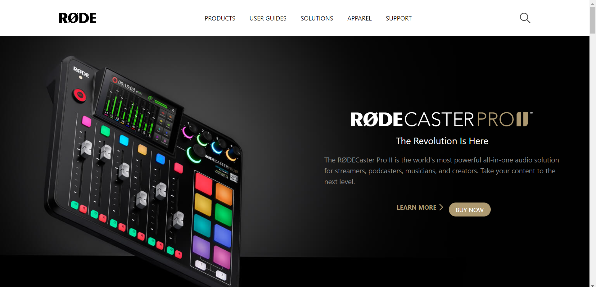
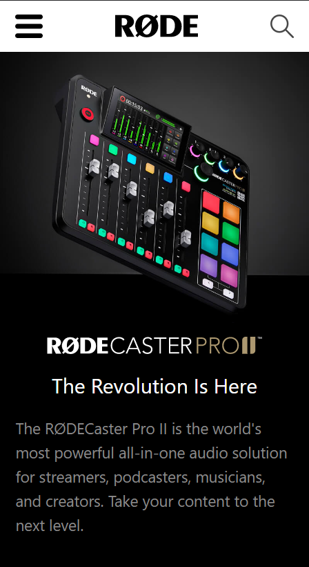

# Hey Welcome

Hi, My name is Uvesh Khatri and I have completed The RØDE Website Clone Using Tailwind CSS

# RØDE Website Clone

In this project i have created a RØDE Website from Scratch. And i learned Mobile responsive design using Tailwind CSS.

### Mobile Responsive ✅

## It took me 1 Day to complete this project

## Tech Stack Used
- HTML5
- Tailwind CSS

[ LIve Link ](https://uveshkhatri-rode-clone.netlify.app/)

